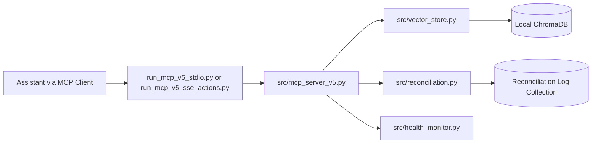

# Second Brain v5

## What Is This?
Second Brain v5 is a local-first personal RAG memory system for AI assistants.  
It stores text chunks plus lightweight metadata in a local ChromaDB, then exposes MCP tools so a new LLM session can quickly recover user context.

This project is built for technical users who want to self-host and control their own data. It is not a SaaS product.

## AIX Philosophy
AIX (AI eXperience) means designing for how LLMs actually consume context:

- Prefer clear text chunks over rigid document schemas.
- Keep metadata minimal but useful: timestamps, confidence, supersedes links, deprecation flags.
- Preserve history with version chains instead of destructive overwrites.
- Return warning-rich tool responses so the model can self-correct write behavior.

The goal is practical retrieval quality and reliable AI behavior, not perfect human taxonomies.

## How It Works


Write path:
1. `store` or `update` writes a chunk.
2. Reconciliation checks for overlap/conflict signals.
3. The system returns warnings/self-heal hints when writes look risky.

Read path:
1. `search` runs semantic retrieval.
2. Ranking blends similarity with lightweight lexical/recency signals.
3. Deprecated chunks stay hidden by default unless explicitly requested.

## Features
Current v5 capabilities:

- MCP tools for `store`, `search`, `update`, `delete`, `get_chunk`, `get_evolution_chain`.
- Versioned updates (`strategy="version"`) with supersedes chains.
- Soft delete by default (history retained), optional hard delete.
- Heuristic reconciliation and conflict logging.
- Warning-first write responses with structured `warnings[]` and self-heal fields.
- Health checks for oversized chunks and unresolved conflicts.
- Local backup/restore commands for the persisted vector DB.
- Stdio transport and SSE transport for MCP clients.
- Optional auth modes for SSE: `none` (local-only), `bearer`, or `oauth`.

## Quickstart
Prerequisites:

- Python 3.11+
- `pip`
- Windows PowerShell or a POSIX shell

1. Clone and install dependencies.

```bash
git clone <your-repo-url>
cd chunking
python -m venv .venv
```

Windows:
```powershell
.\.venv\Scripts\Activate.ps1
pip install -r requirements.txt
```

macOS/Linux:
```bash
source .venv/bin/activate
pip install -r requirements.txt
```

2. Ensure the embedding model is available locally (one-time).

```bash
python -c "from sentence_transformers import SentenceTransformer; SentenceTransformer('all-MiniLM-L6-v2')"
```

3. Optional: create a local config override (kept out of git).

Windows PowerShell:
```powershell
Copy-Item config.example.json config.json
```

macOS/Linux:
```bash
cp config.example.json config.json
```

If you skip this, built-in defaults are used (local-first, `MCP_AUTH_MODE=none`).

4. Run a direct local verification (no MCP client required yet).

```bash
python examples/try_local.py
```

This performs one write and one retrieval, and creates `./chroma_db` automatically on first write.

5. Run MCP over stdio (recommended starting point for real usage).

```bash
python run_mcp_v5_stdio.py
```

6. Optional: run SSE server.

```bash
python run_mcp_v5_sse_actions.py
```

SSE endpoints:

- `http://localhost:8000/mcp`
- `http://localhost:8000/sse`
- `http://localhost:8000/messages/`
- `http://localhost:8000/health`

7. Optional: expose SSE through an external relay workspace.

- Keep relay scripts/config in a separate folder outside this repository.
- Point the relay to `http://localhost:8000`.

## Example Workflow
### 1. Store memory
```text
tool: store
input: {
  "text": "I moved my daily deep work block to 6:30-9:00 AM. This is now my default schedule."
}
```

### 2. Retrieve memory
```text
tool: search
input: {
  "query": "current deep work schedule",
  "top_k": 5
}
```

### 3. Bootstrap a new LLM session
Use a focused retrieval pass, then summarize:

```text
search("current work schedule and constraints")
search("active priorities this month")
search("current preferences and hard boundaries")
```

Then synthesize only active, non-deprecated chunks into a short session brief for the new model instance.

More sample chunks and retrieval flows are in [`examples/`](examples).

## Local Data And Git Hygiene
- Real memory data is stored in `./chroma_db` by default and is generated locally at runtime.
- Local DB and backup folders are ignored by git (`chroma_db/`, `backups/`, and common DB file extensions).
- `config.json` is treated as local machine config and is ignored by git.
- Keep commit-safe templates in `config.example.json` and `.env.example`.

## Privacy And Deployment
- Default posture is local-first and user-controlled.
- Data is stored in local ChromaDB files under the configured persist directory.
- The server itself does not require a cloud backend.
- Optional remote access is available through user-managed tunneling.
- Do not commit real secrets. Use local config/env values for auth credentials.

## Open Source Status
This is an early but usable v1 release.

- Stable enough for personal self-hosted workflows.
- APIs and internal heuristics may still change between minor versions.
- Some rough edges are documented in [`docs/limitations.md`](docs/limitations.md).

## Documentation
- Setup guide: [`docs/setup.md`](docs/setup.md)
- Integration guide (ChatGPT + Claude Desktop): [`docs/integrations.md`](docs/integrations.md)
- Architecture details: [`docs/architecture.md`](docs/architecture.md)
- AIX notes: [`docs/aix.md`](docs/aix.md)
- Limitations: [`docs/limitations.md`](docs/limitations.md)
- Roadmap: [`docs/roadmap.md`](docs/roadmap.md)

## Contributing
See [`CONTRIBUTING.md`](CONTRIBUTING.md).

## License
MIT. See [`LICENSE`](LICENSE).
